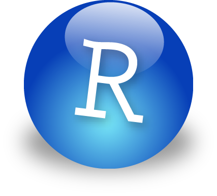

Cette application interactive repose intégralement sur le framework *shiny*, développé pour le logiciel *R*, par l'équipe de RStudio. D'autres packages additionnels ont été nécessaires pour la concevoir, dont *plyr* et *ggplot2*.

**L'ensemble de ces outils sont open-source et peuvent être téléchargés gratuitement :**

Pour plus d'informations sur ces outils, vous pouvez consulter les adresses suivantes : 

* Le logiciel R : http://cran.r-project.org
* L'IDE RStudio : http://www.rstudio.com
* Le framework shiny : http://shiny.rstudio.com
* La liste des packages disponibles sous R : 

L'intégralité du code de cette application est disponible en ligne sur [GitHub](http://github.com/hellvince/TdbApp)
